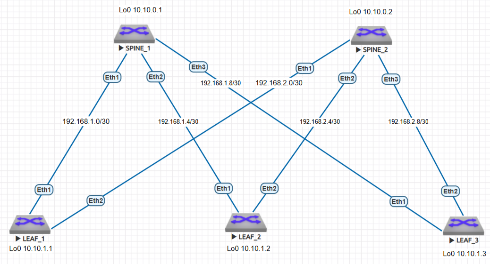

Распределение IP-адресов
============

В схеме **CLOS** собраны 2 `Spine` и 3 `Leaf` коммутатора.

Для ptp-соединений выбраны подсети 192.168.1.0/30 192.168.1.4/30 192.168.1.8/30 для первого `Spine` и  192.168.2.0/30 192.168.2.4/30 192.168.2.8/30 для второго `Spine` .

Для Loopback-адресов выбраны подсети 10.10.0.[1-2] для `Leaf` и 10.10.10.[1-3] для `Spine`, соответственно.
