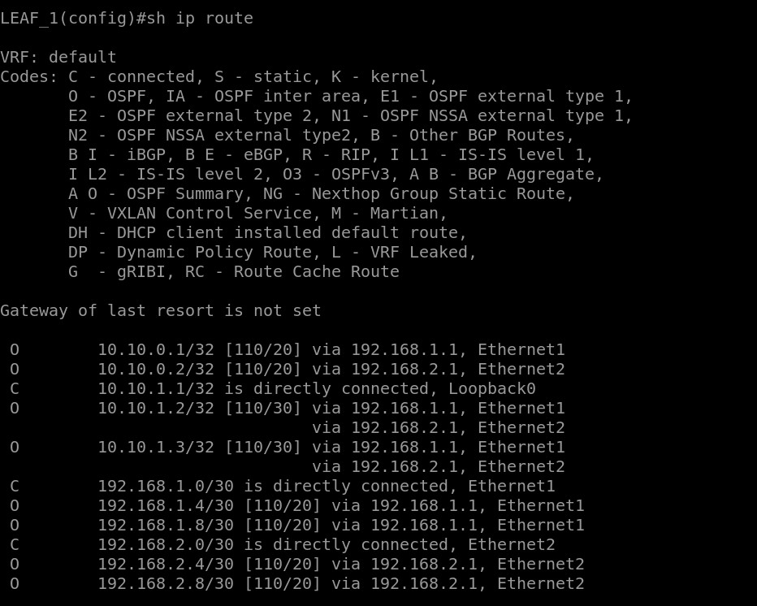
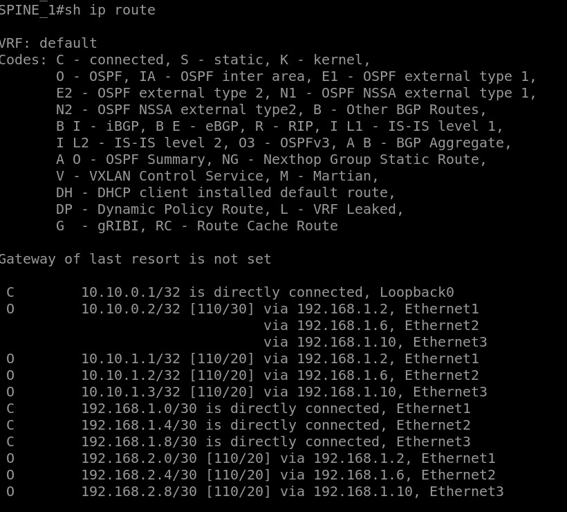
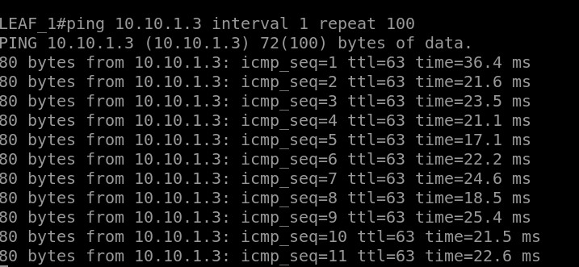

Сборка схемы
============

В схеме **CLOS** собраны 2 `Spine` и 3 `Leaf` коммутатора.

OSPF-маршрутизация
============
На каждом устройстве настроен OSPF:  `Area` **0.0.0.0**, `Instance` **100**, `RouterID` назначен идентичный IP-адресу **Loopback интерфейса**, `passive-interface` **default**, Loopback-интерфесы добавлены в `Area` **0.0.0.0**

На `Spine`-коммутаторах на **ETHERNET[1-3]**: **отключен** `passive-interface`, добавлена `Area` **0.0.0.0**, `network` **point-to-point** 
На `Leaf`-коммутаторах на **ETHERNET[1-2]**: **отключен** `passive-interface`, добавлена `Area` **0.0.0.0**, `network` **point-to-point** 

Проверка работы
============

Таблицы маршрутизации:

Проверка доступности устройств по **Loopback**-адресам:

READY!
============

