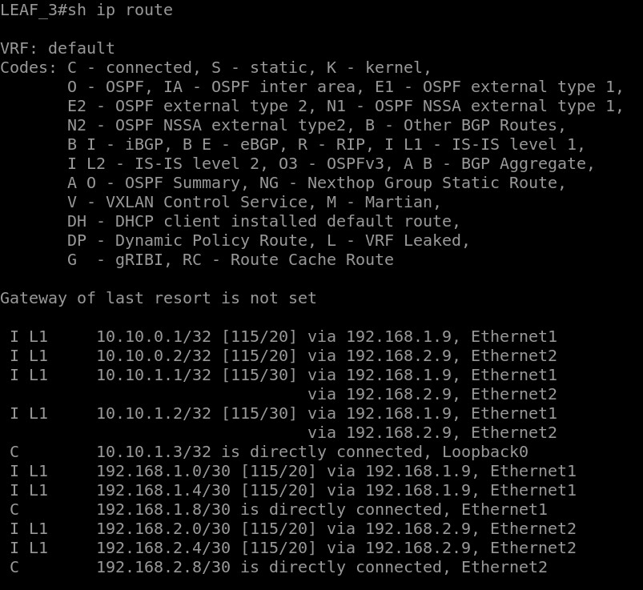
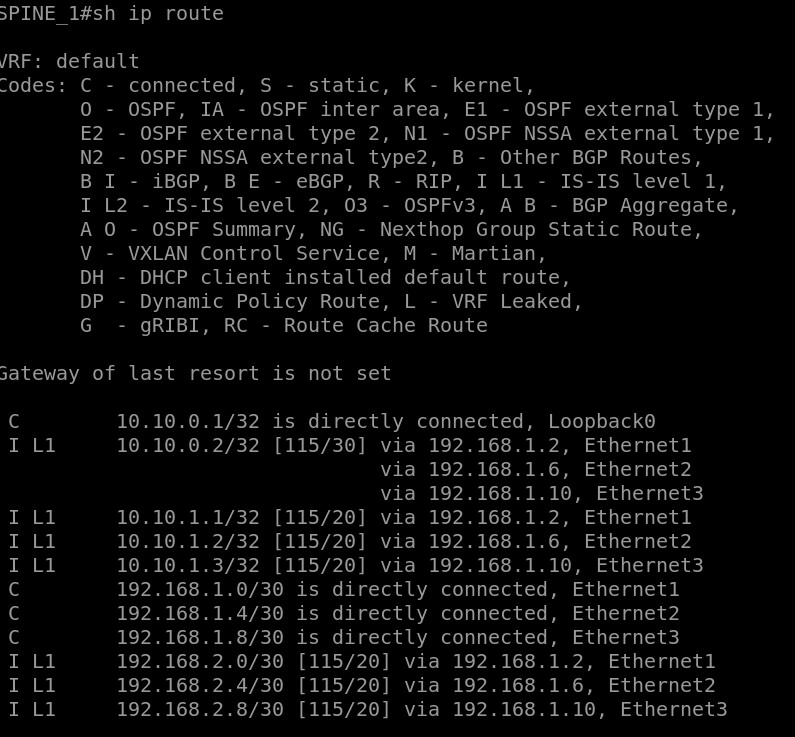
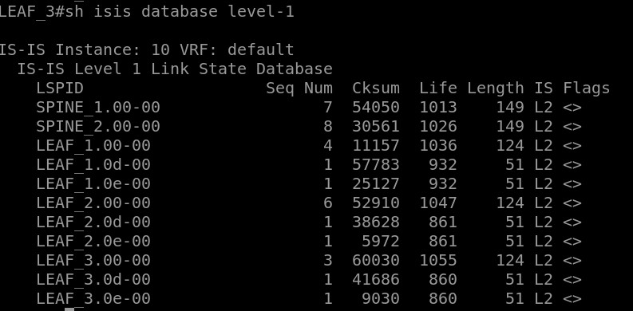
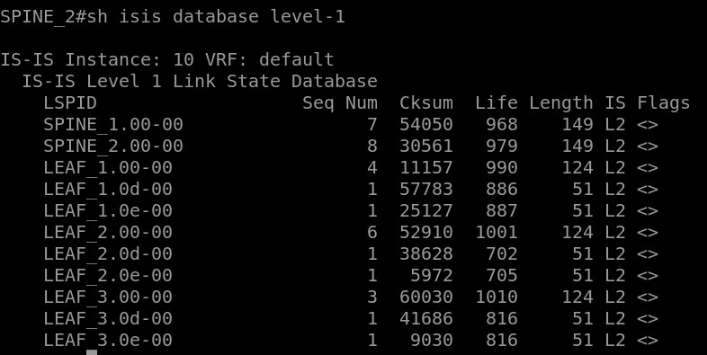
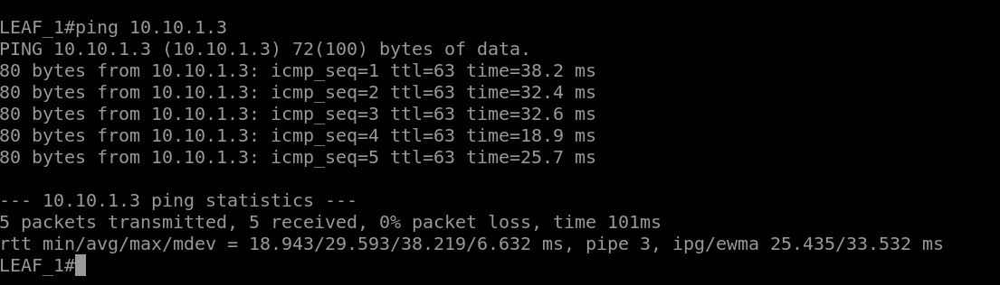

Сборка схемы
============

В схеме **CLOS** собраны 2 `Spine` и 3 `Leaf` коммутатора.

ISIS-маршрутизация
============

Проверка работы
============

**Таблицы маршрутизации:**

**ISIS Database:**

Проверка доступности устройств по **Loopback**-адресам:

READY!
============

